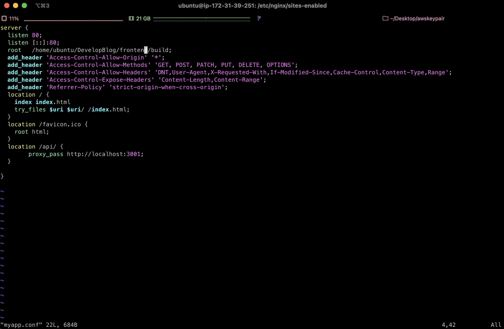
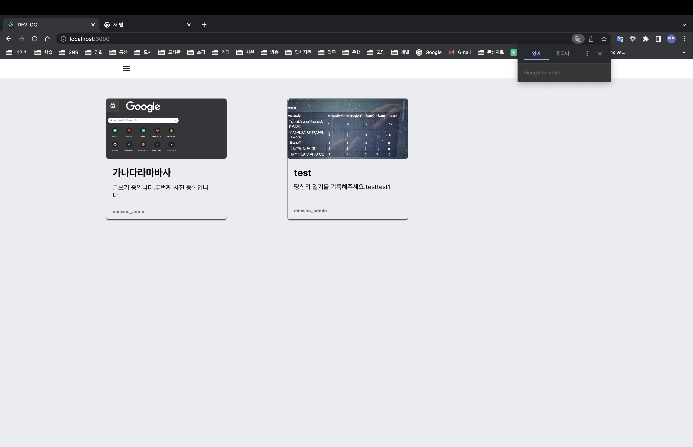
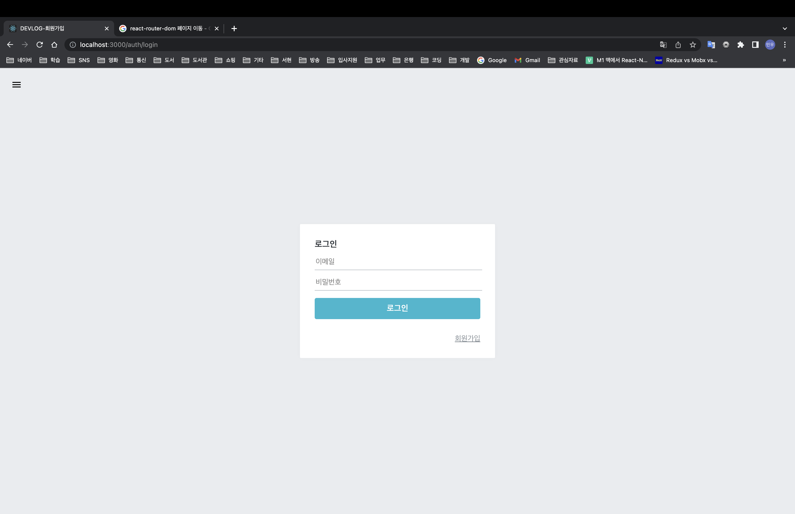
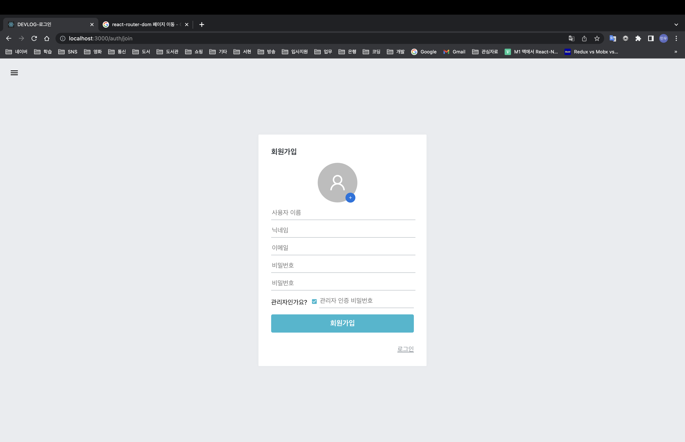
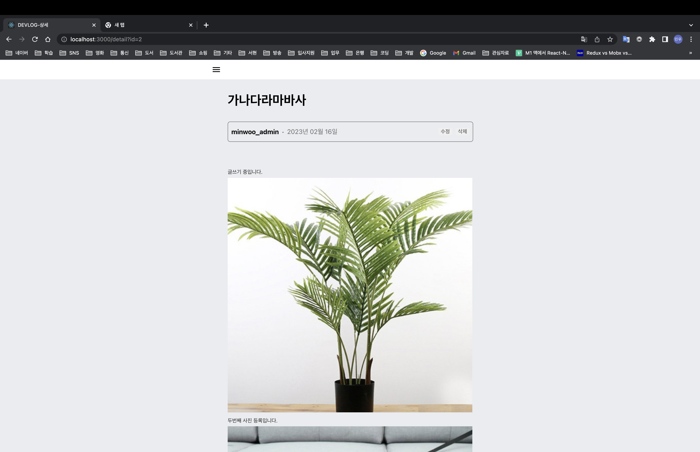
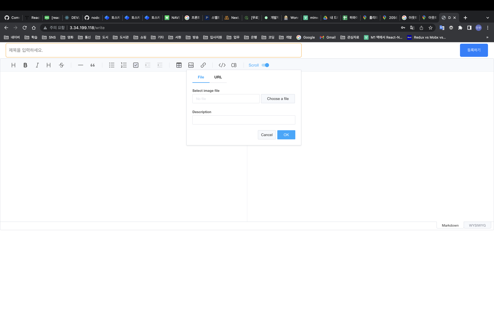

# DevLog

---

- 제가 현재도 사용하고 있는 Velog에서 착안해서 진행한 블로그 사이트
  - Velog와 스타일은 비슷하게, UI는 일부 수정해서 개발함
- 적용 기능
  - 블로그 작성
  - 검색
  - 마이페이지
    - 프로필 사진 적용
    - 사용자 커스텀 배경화면
  - 댓글 기능

## 기술 스택

---

- Frontend
  - React, TypeScript
  - React-Router-Dom(SPA)
  - 에디터: [ToastUI](https://ui.toast.com/tui-editor)
  - 기타 사용 UI 도구: [mui](https://mui.com/)
  - 배포: NGINX
- Backend
  - Nodejs
    - [Express](https://expressjs.com/ko/)
    - 로그인 기능 구현: [passport](https://www.passportjs.org/)
  - DB: MySQL
  - 파일 업로드: AWS S3
  - 백엔드 실행: [PM2](https://pm2.keymetrics.io/)
- AWS
  - 주 사용 리전: AP-NORTHEAST-2(서울)
  - EC2
    - 인스턴스 정리
      - 프론트엔드+백엔드 프로젝트: (퍼블릭 IP 비공개)
        ⇒ 현재 해당 인스턴스는 삭제한 상태(비용적인 문제)
      - DB(MySQL): (퍼블릭 IP 비공개)
  - S3
    - 버킷명: d\***\*\*\*\***

## 기본 설계 내용 정리

---

- 프론트와 백 프로젝트는 하나의 인스턴스에서 실행
- 프론트에서 API 호출 시 Proxy를 통해 코드 내에 백엔드 프로젝트 호스트가 노출되지 않도록 함.
- Backend
  - PM2를 사용한 무중단 배포
  - 파일 업로드 순서
    - 업로드 API 실행시 헤더에 저장된 토큰을 1차로 검증
    - 토큰 검증 완료 후 AWS에 파일 업로드
    - 업로드 완료 결과값을 토대로 DB에 파일 데이터 저장
  - 사용자 인증 방식: 토큰 발행(JWT)
    - 로그인 후 발행된 토큰을 브라우저 쿠키에 저장하도록 함
  - DB 테이블 명 정리
    - Comment: 댓글
    - User: 사용자 정보
    - Content: 게시글
    - File: S3에 저장된 파일 정보
- Frontend
  - CRA 내장 webpack을 통해 추출한 빌드 파일을 NGINX로 실행
  - backend API 호출: Proxy 설정을 통해 호출
  - 로그인 시 반환값으로 전달받은 토큰을 브라우저 쿠키로 저장
    - 페이지를 나갔다가 다시 들어올 때 쿠키에 저장된 토큰으로 유효성 여부 검증(API 실행)

## 개발시 느낀 점,생각

---

- NGINX 사용법이 생각보다 어렵지 않았다는 점
  - 내가 모바일 개발자라서 이전에 NGINX를 다뤄본 적이 한번도 없어서 백지상태에서 시작을 했다.
  - 그런만큼 걱정을 많이 했는데 생각만큼 어렵지는 않았었다.
    ⇒ 물론 이 프로젝트가 실제로 릴리즈할 목적으로 만든 것은 아니기 때문에 보안과 관련된 설정이 모두 제거되어서 그런 것 같다.
    ⇒ 만약에 실제 운영에 필요한 정도로 설정을 하려고 하면 어려울 수 있다.
    DevLog 프로젝트를 위해 설정한 실제 NGINX 설정 내용
    
- React-Native와 React간의 사용가능한 기능의 혼동

  - 개발시 메인 페이지에 접근할 때마다 게시글 목록을 업데이트 해줘야 하는 부분이 있었는데, React-Native에서는 useFocusEffect를 사용해서 페이지가 열릴 때마다 목록을 갱신하는 API를 호출하면 되지만, React에서는 그게 불가능했다.
  - useFocusEffect라는 기능이 React-Native에서의 React-Navigation에서만 사용이 가능한 기능이고, 실제로 사용한 React-Router-Dom에서는 이와 유사한 기능을 아직 찾지 못했다.
  - 이를 대신해 페이지 이동 직전 async-await을 사용해 비동기로 게시글 목록을 불러오는 API를 호출하고 완료가 되면 페이지로 이동하도록 처리하였다.

- Styled-Components를 사용하는데 약간 불편하였다.

  - Styled-Component라는 기능의 방식이 텍스트 안에다가 CSS값을 적용하는 방식이다 보니 자동완성 기능을 사용할 수 없었다는 점에서 약간 불편하였다.
  - 하지만 이렇게 일일히 작성하는 것이 실력향상에는 좋을 것 같다는 생각에 이 방식대로 계속 진행하였다.

- Redux 구조 TypeScript로 설계
  - 회사 프로젝트에서 Redux를 JavaScript로 설계한 것과 달리, 이번 프로젝트에서는 프론트 부분은 전부 TypeScript로 설계하면서, Redux 설계에 어려움이 있었다.
  - Velopert의 Redux 설계 관련 블로그를 참고하면서 설계하였다.

## 사이트 이미지

---

